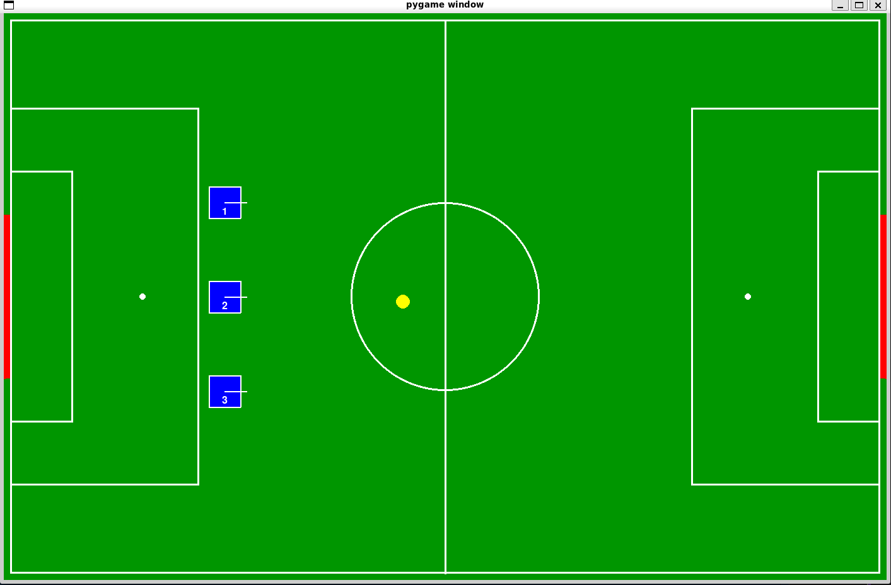

# strategy_sim
A 2D simulator for strategy development.

## Requirements
- Ubuntu 22.04
- ROS 2 Humble
- uv

## Build Instructions
1. `make venv`
2. `source .venv/bin/activate`
3. Build this module.
4. `ros2 run strategy_sim main.py` This launches the strategy simulation.

## Usage
The image below shows the simulation running. The yellow circle near the center is the ball. The red areas at the left and right ends are the goals. The blue squares represent the robots, with their ID numbers displayed inside.

- You can move the ball and robots by dragging them with the mouse.
- Press **"r"** on the keyboard to reset the ball to its initial position.
- Press **"g"** on the keyboard to reset the robots to their initial positions.

When the ball enters the goal, you must manually operate the game controller to notify the strategy side that a point has been scored.

### Sending Movement Commands to Robots
Each robot subscribes to the `/LocoAPiTopicReq_[robot_id]` topic (verifiable via `ros2 topic list`). You can issue commands to a robot by publishing messages to this topic.
Basically, the ball is moved by the robots colliding with it.

### Receiving Robot Information
- **Odometry**
  - Topic: `/odometer_state_[robot_id]`
- **Self-Position (with noise)**
  - Topic: `/self_position_[robot_id]`
- **Object Detection (with noise)**
  - Topic: `/booster_vision/detection_[robot_id]`
- **Neck Angle**
  - Topic: `/low_state_[robot_id]`
- **Self-Position (Ground Truth)**
  - Topic: `/true_state/self_position_[robot_id]`
- **Object Detection (Ground Truth)**
  - Topic: `/true_state/booster_vision/detection_[robot_id]`

## License

MIT License - See [LICENSE](LICENSE) for details.